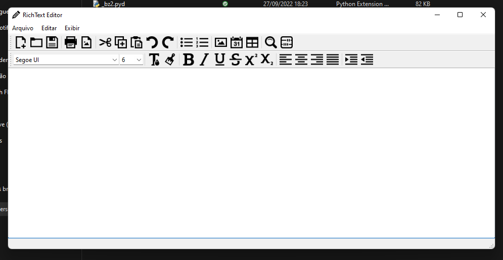

# ❤ RichText Editor

Editor de texto escrito em Python, originalmente com o framework PyQt4 por [goldsborough](https://github.com/goldsborough/Writer).

Projeto reescrito usando a última versão do framework, PyQt6.

## ⚙ Funcionalidades

- Gerenciamento de arquivos
- Formatação de texto rico (HTML)
- Inserção e edição de tabelas
- Inserção de imagens
- Salvamento de preferências do usuário
- Procurar e substituir

## 🛠 Tecnologias

- Python
- PyQt6
- JSON
- Git e GitHub